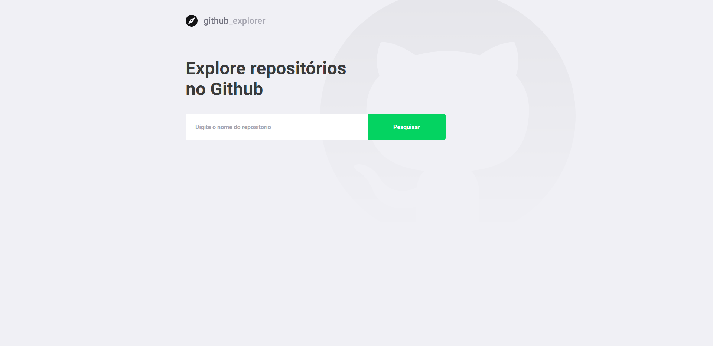

# GITHUBEXPLORER

> Aplicação desenvolvida durante o bootcamp GoStack da Rockeatseat para mostrar elegantemente os repositórios
false

# Frontend

## Como rodar | Usage

> **cd frontend** && **yarn**
>
> **yarn** start 

## Rotas | Routes

| Rota | Descrição |
| ------ | ---- | 
|    /    |   Dashboard, página principal com listagem dos repositórios a partir de inserção manual   | 
|    /repositories/:repository+    | Repositorio, página com mais detalhes e issues daquele repositório em específico     | 

## Dependências de Produção | Production dependencies

| Dependência      | Utilização |
| ----------- | ----------- |
| react    | Biblioteca componentizada e flexível para criação de interfaces  |
| typescript    | Superset da linguagem JavaScript, permite a utilização de tipagem estática  |
| styled-components    | Permite utilização do CSS em JS  |
| polished    | Escure ou clareia tons de cores do CSS com facilidade  |
| @testing-library/jest-dom    | Framework de teste unitário  |

## Dependências de Desenvolvimento | Development dependencies

| Dependência      | Utilização |
| ----------- | ----------- |
| eslint    | Linter para monitoramento do código e indicação de erros  |
| prettier    | Formatador de código, deixando-o padronizado  |

